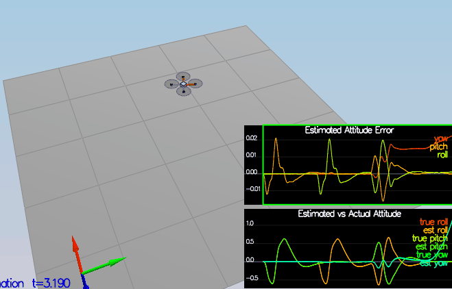
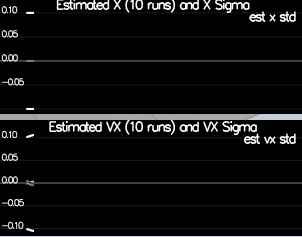

## Project: Estimation Project
---

## The Tasks ##

Once again, you will be building up your estimator in pieces.  At each step, there will be a set of success criteria that will be displayed both in the plots and in the terminal output to help you along the way.

Project outline:

 - [Step 1: Sensor Noise](#step-1-sensor-noise)
 - [Step 2: Attitude Estimation](#step-2-attitude-estimation)
 - [Step 3: Prediction Step](#step-3-prediction-step)
 - [Step 4: Magnetometer Update](#step-4-magnetometer-update)
 - [Step 5: Closed Loop + GPS Update](#step-5-closed-loop--gps-update)
 - [Step 6: Adding Your Controller](#step-6-adding-your-controller)
 
### Step 1: Sensor Noise ###

The standard deviation can be computed using the following python script
```
import numpy as np


```

Here is the values for `MeasuredStdDev_GPSPosXY` and `MeasuredStdDev_AccelXY`:
```
MeasuredStdDev_GPSPosXY = 0.657
MeasuredStdDev_AccelXY = 0.49
```


### Step 2: Attitude Estimation ###

The implementation is based on "Estimation for Quadrotors" paper with a small modification.
The predicted quaternion is calculated by multiplying a quaternion for euler angles and the quaternion for (IMU measurement * dt).
A better estimation can be achieved as a result.



### Step 3: Prediction Step ###

The implementation is based on "Estimation for Quadrotos" paper.




Here is the values for `QPosXYStd` and `QVelXYStd`:
```
QPosXYStd  = .01
QVelXYStd = .2
```

### Step 4: Magnetometer Update ###

Here is the values for `QYawStd `:
```
QYawStd  = .1
```


### Step 5: Closed Loop + GPS Update ###


### Step 6: Adding Your Controller ###

This is how the result is when using the real controller.


